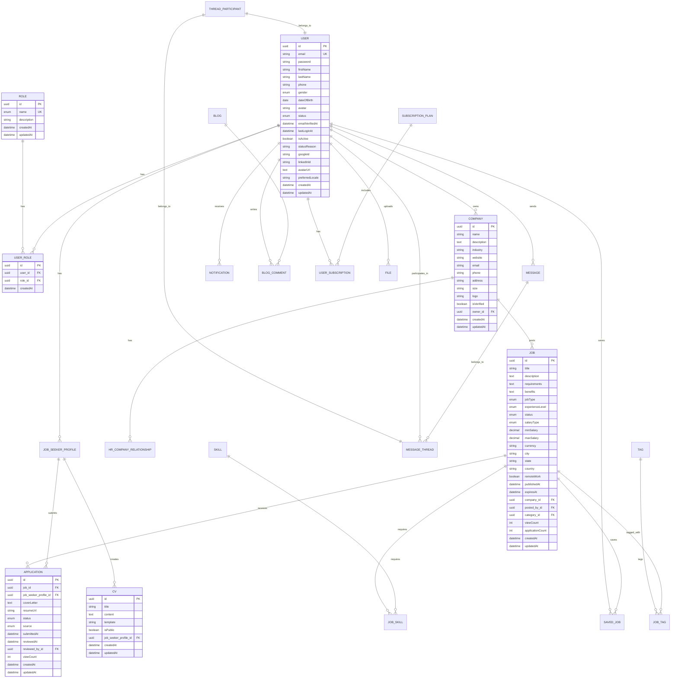
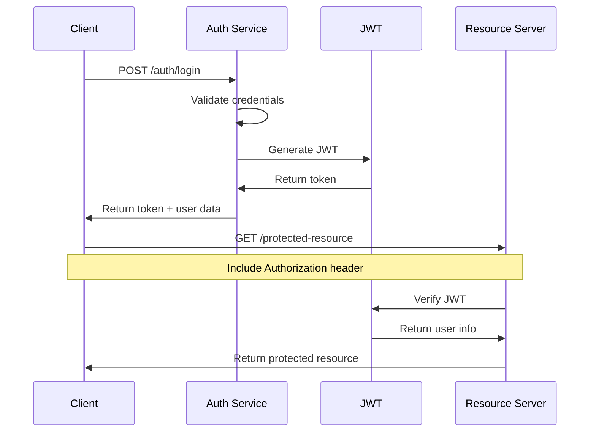

# CVKing Technical Architecture

## System Overview

CVKing is a modern full-stack job portal application built with a microservices-inspired architecture using NestJS for the backend and Next.js for the frontend. The system follows industry best practices for scalability, security, and maintainability.

## Architecture Diagram

```
┌─────────────────────────────────────────────────────────────────┐
│                        FRONTEND (Next.js)                       │
├─────────────────────────────────────────────────────────────────┤
│  Authentication  │  Job Listings  │  Company Pages  │  Dashboard │
│  CV Builder      │  Blog System   │  Messaging     │  API Routes │
└─────────────────────────────────────────────────────────────────┘
                              │ HTTP/HTTPS
                              ▼
┌─────────────────────────────────────────────────────────────────┐
│                        LOAD BALANCER                            │
└─────────────────────────────────────────────────────────────────┘
                              │
                              ▼
┌─────────────────────────────────────────────────────────────────┐
│                        BACKEND (NestJS)                         │
├─────────────────────────────────────────────────────────────────┤
│  Auth Module  │  Jobs Module  │  Users Module  │  Companies    │
│  Applications  │  CV Module   │  Blog Module   │  Messaging    │
│  Notifications │  Subscriptions│  Skills Module │  Upload Module │
└─────────────────────────────────────────────────────────────────┘
                              │ Database Queries
                              ▼
┌─────────────────────────────────────────────────────────────────┐
│                        DATABASE (MySQL)                         │
├─────────────────────────────────────────────────────────────────┤
│  Users  │  Roles  │  Companies  │  Jobs  │  Applications  │  CVs │
│  Messages│  Notifications│  Subscriptions│  Skills  │  Blog Posts │
└─────────────────────────────────────────────────────────────────┘
                              │ File Storage
                              ▼
┌─────────────────────────────────────────────────────────────────┐
│                      FILE STORAGE (Local/S3)                    │
├─────────────────────────────────────────────────────────────────┤
│  Company Logos  │  User Avatars  │  CV Documents  │  Images     │
└─────────────────────────────────────────────────────────────────┘
```

## Backend Architecture (NestJS)

### Module Structure

#### Core Modules

1. **Auth Module** (`/backend/src/modules/auth/`)
   - JWT-based authentication
   - Role-based authorization
   - Social login integration
   - Password hashing and validation
   - Refresh token management

2. **Jobs Module** (`/backend/src/modules/jobs/`)
   - Job CRUD operations
   - Advanced search and filtering
   - Job status management
   - Application tracking
   - Salary and location filtering

3. **Users Module** (`/backend/src/modules/users/`)
   - User profile management
   - Role assignment
   - Social login fields
   - User status management
   - Profile completion tracking

4. **Companies Module** (`/backend/src/modules/companies/`)
   - Company profile management
   - Company ownership
   - HR user assignment
   - Company verification
   - Subscription management

#### Supporting Modules

5. **Applications Module** (`/backend/src/modules/applications/`)
   - Job application workflow
   - Application status tracking
   - Cover letter management
   - Resume attachment
   - Application analytics

6. **CV Module** (`/backend/src/modules/cv/`)
   - CV creation and editing
   - Template system
   - Public/private CVs
   - CV sharing
   - CV analytics

7. **Blog Module** (`/backend/src/modules/blog/`)
   - Content management
   - Article publishing
   - Comment system
   - Category management
   - Content analytics

8. **Messaging Module** (`/backend/src/modules/messaging/`)
   - Real-time chat
   - Message threads
   - Thread participants
   - Message status tracking
   - WebSocket integration

9. **Notifications Module** (`/backend/src/modules/notifications/`)
   - Email notifications
   - In-app notifications
   - Notification preferences
   - Notification history
   - Push notification support

10. **Subscriptions Module** (`/backend/src/modules/subscriptions/`)
    - Premium plans
    - Billing management
    - Feature access control
    - Subscription analytics
    - Plan upgrades/downgrades

### Common Layer

#### Entities (`/backend/src/modules/common/entities/`)
- **BaseEntity**: Common fields (id, createdAt, updatedAt)
- **User**: User accounts with roles
- **Role**: Permission-based roles
- **UserRole**: Many-to-many relationship
- **Job**: Job listings
- **Company**: Company profiles
- **Application**: Job applications
- **CV**: Resume/CV management
- **Message**: Chat messages
- **Notification**: User notifications

#### Guards (`/backend/src/modules/common/guards/`)
- **JwtGuard**: JWT authentication
- **RolesGuard**: Role-based authorization
- **PermissionsGuard**: Fine-grained permissions

#### Decorators (`/backend/src/modules/common/decorators/`)
- **@Roles()**: Role-based access
- **@RequirePermissions()**: Permission-based access
- **@CurrentUser()**: Inject current user

## Frontend Architecture (Next.js)

### App Structure

#### Pages (`/frontend/src/app/`)
- **Layout**: Main application layout
- **Home**: Landing page with hero section
- **Auth**: Login/Register pages
- **Jobs**: Job listing and detail pages
- **Companies**: Company profiles
- **Dashboard**: Role-specific dashboards
- **CV Builder**: Resume creation
- **Blog**: Content browsing

#### Components (`/frontend/src/components/`)
- **Header**: Navigation and user menu
- **Footer**: Site footer
- **ConditionalLayout**: Layout wrapper
- **Auth Components**: Login/Register forms
- **UI Components**: Reusable UI elements
- **Hero Components**: Landing page sections

#### Services (`/frontend/src/services/`)
- **API Service**: Base API configuration
- **Auth Service**: Authentication operations
- **Job Service**: Job-related API calls
- **User Service**: User management
- **Company Service**: Company operations
- **CV Service**: Resume management
- **Messaging Service**: Chat functionality

### State Management

#### Client-Side State
- **localStorage**: User authentication and preferences
- **React Context**: Global application state
- **Component State**: Local component state
- **URL State**: Query parameters for filtering

#### Server-Side State
- **Next.js App Router**: Server components
- **API Routes**: Server-side API endpoints
- **Database**: Persistent data storage

## Database Design

### Entity Relationships



### Database Indexes

#### Performance-Critical Indexes
- `users(email)` - User login
- `jobs(company_id, status)` - Company job listings
- `applications(job_id, status)` - Job application tracking
- `messages(thread_id, createdAt)` - Message thread ordering
- `notifications(user_id, isRead)` - User notification filtering

#### Search Indexes
- `jobs(title, description)` - Full-text search
- `companies(name, industry)` - Company search
- `users(firstName, lastName)` - User search

## API Design

### RESTful Endpoints

#### Authentication
```http
POST /auth/register     # User registration
POST /auth/login        # User login
POST /auth/refresh      # Token refresh
GET  /auth/profile      # Get user profile
PUT  /auth/profile      # Update user profile
POST /auth/change-password  # Change password
```

#### Jobs
```http
GET    /jobs                    # List jobs with filters
POST   /jobs                    # Create job (employer/HR)
GET    /jobs/:id               # Get job details
PUT    /jobs/:id               # Update job
DELETE /jobs/:id               # Delete job
POST   /jobs/:id/publish       # Publish job
POST   /jobs/:id/close         # Close job
GET    /jobs/company/:companyId # Get company jobs
```

#### Applications
```http
GET    /applications           # List user applications
POST   /applications           # Apply for job
GET    /applications/:id       # Get application details
PUT    /applications/:id       # Update application
DELETE /applications/:id       # Delete application
GET    /applications/job/:jobId # Get job applications
```

#### Users
```http
GET  /users                    # List users (admin)
GET  /users/:id               # Get user details
PUT  /users/:id               # Update user
DELETE /users/:id             # Delete user
GET  /users/profile/me        # Get own profile
PUT  /users/profile/me        # Update own profile
```

### API Response Format

#### Success Response
```json
{
  "success": true,
  "data": {
    // Response data
  },
  "message": "Operation successful",
  "timestamp": "2024-01-01T00:00:00.000Z"
}
```

#### Error Response
```json
{
  "success": false,
  "error": {
    "code": "VALIDATION_ERROR",
    "message": "Validation failed",
    "details": [
      {
        "field": "email",
        "message": "Email is required"
      }
    ]
  },
  "timestamp": "2024-01-01T00:00:00.000Z"
}
```

## Security Architecture

### Authentication Flow



### Authorization Strategy

#### Role-Based Access Control (RBAC)
- **Admin**: Full system access
- **Employer**: Company management
- **HR**: Recruitment within company
- **Job Seeker**: Job search and applications

#### Permission-Based Access
- Fine-grained permissions per role
- Resource-level access control
- Action-based permissions (CRUD operations)

### Security Measures

#### Input Validation
- Request validation with class-validator
- Sanitization of user inputs
- SQL injection prevention (ORM)
- XSS protection

#### Data Protection
- Password hashing with bcrypt
- JWT token expiration
- Secure cookie configuration
- CORS configuration

#### Rate Limiting
- API rate limiting per user
- Brute force protection
- DDoS protection considerations

## Performance Optimization

### Backend Optimization

#### Database Optimization
- **Connection Pooling**: MySQL connection pooling
- **Query Optimization**: Eager loading for relationships
- **Indexing**: Strategic indexes on frequently queried fields
- **Pagination**: Cursor-based pagination for large datasets

#### Caching Strategy
- **Redis Integration**: Ready for Redis caching
- **Query Caching**: Database query result caching
- **Static Content**: CDN for static assets

#### API Optimization
- **Compression**: Gzip compression enabled
- **Response Optimization**: Selective field loading
- **Async Processing**: Background job processing

### Frontend Optimization

#### Bundle Optimization
- **Code Splitting**: Next.js dynamic imports
- **Tree Shaking**: Remove unused code
- **Bundle Analysis**: Monitor bundle size

#### Performance Monitoring
- **Core Web Vitals**: Monitor loading performance
- **Error Tracking**: Client-side error monitoring
- **User Analytics**: Track user behavior

#### Caching Strategy
- **Browser Caching**: Static asset caching
- **API Caching**: Request/response caching
- **Service Worker**: Offline functionality

## Scalability Considerations

### Horizontal Scaling
- **Stateless Design**: No server-side session storage
- **Load Balancing**: Ready for load balancer integration
- **Database Scaling**: Read replicas support

### Microservices Readiness
- **Module Separation**: Clear module boundaries
- **API Gateway**: Ready for API gateway integration
- **Service Discovery**: Service registry support

### Cloud Native Features
- **Container Orchestration**: Docker Compose ready
- **Kubernetes**: Kubernetes deployment support
- **Cloud Services**: Cloud provider integration

## Monitoring & Observability

### Logging Strategy
- **Structured Logging**: JSON format logs
- **Log Levels**: Debug, info, warn, error
- **Log Aggregation**: Centralized logging

### Metrics Collection
- **Application Metrics**: Performance metrics
- **Business Metrics**: User engagement metrics
- **Infrastructure Metrics**: System health metrics

### Health Checks
- **Application Health**: API health endpoints
- **Database Health**: Database connection checks
- **External Service Health**: Third-party service checks

This technical architecture provides a solid foundation for a scalable, secure, and maintainable job portal application that can handle growth and evolving requirements.